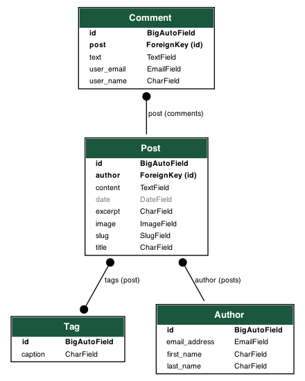

<a name="readme-top"></a>

[![Contributors][contributors-shield]][contributors-url]
[![Forks][forks-shield]][forks-url]
[![Stargazers][stars-shield]][stars-url]
[![Issues][issues-shield]][issues-url]
[![MIT License][license-shield]][license-url]
[![LinkedIn][linkedin-shield]][linkedin-url]

<!-- PROJECT LOGO -->
<br />
<div align="center">
  <a href="https://github.com/MateuszKrolik/DJ-BLOG">
    
  </a>

<h3 align="center">Django Blog</h3>

  <p align="center">
    Personal Django Blog
    <br />
    <a href="https://github.com/MateuszKrolik/DJ-BLOG"><strong>Explore the docs »</strong></a>
    <br />
    <br />
    <a href="https://github.com/MateuszKrolik/DJ-BLOG">View Demo</a>
    ·
    <a href="https://github.com/MateuszKrolik/DJ-BLOG/issues/new?assignees=&labels=bug&projects=&template=bug-report.md" >Report Bug</a>
    ·
    <a href="https://github.com/MateuszKrolik/DJ-BLOG/issues/new?assignees=&labels=enhancement&projects=&template=feature-request.md">Request Feature</a>
  </p>
</div>

<!-- TABLE OF CONTENTS -->
<details>
  <summary>Table of Contents</summary>
  <ol>
    <li>
      <a href="#about-the-project">About The Project</a>
      <ul>
        <li><a href="#built-with">Built With</a></li>
      </ul>
    </li>
    <li>
      <a href="#getting-started">Getting Started</a>
      <ul>
        <li><a href="#prerequisites">Prerequisites</a></li>
        <li><a href="#installation">Installation</a></li>
      </ul>
    </li>
    <li><a href="#roadmap--usage">Roadmap</a></li>
    <li><a href="#contributing">Contributing</a></li>
    <li><a href="#license">License</a></li>
    <li><a href="#contact">Contact</a></li>
  </ol>
</details>

<!-- ABOUT THE PROJECT -->

## About The Project

[![Product Name Screen Shot][product-screenshot-1]](https://7fv67jhrs7irzzkb2jieakni2i0elmww.lambda-url.eu-central-1.on.aws)

[![Product Name Screen Shot][product-screenshot-2]](https://7fv67jhrs7irzzkb2jieakni2i0elmww.lambda-url.eu-central-1.on.awsposts)
[![Product Name Screen Shot][product-screenshot-3]](<[https://example.com](https://7fv67jhrs7irzzkb2jieakni2i0elmww.lambda-url.eu-central-1.on.awsposts/title)>)
[![Product Name Screen Shot][product-screenshot-4]](<[https://example.com](https://7fv67jhrs7irzzkb2jieakni2i0elmww.lambda-url.eu-central-1.on.awsread-later)>)
[![Product Name Screen Shot][product-screenshot-5]](https://7fv67jhrs7irzzkb2jieakni2i0elmww.lambda-url.eu-central-1.on.awsadmin/login/?next=/admin/)
[![Product Name Screen Shot][product-screenshot-6]](https://7fv67jhrs7irzzkb2jieakni2i0elmww.lambda-url.eu-central-1.on.awsadmin/)
[![Product Name Screen Shot][product-screenshot-7]](https://7fv67jhrs7irzzkb2jieakni2i0elmww.lambda-url.eu-central-1.on.awsadmin/blog/post/add/)
[![Product Name Screen Shot][product-screenshot-8]](https://7fv67jhrs7irzzkb2jieakni2i0elmww.lambda-url.eu-central-1.on.awsadmin/blog/post/add/)

<p align="right">(<a href="#readme-top">back to top</a>)</p>

### Built With

- [![Python][Python.com]][Python-url]
- [![Django][Django.com]][Django-url]
- [![PostgreSQL][PostgreSQL.com]][PostgreSQL-url]
- [![AWS][AWS.com]][AWS-url]
- [![AWS RDS][AWS-RDS.com]][AWS-RDS-url]
- [![AWS S3][AWS-S3.com]][AWS-S3-url]
- [![AWS IAM][AWS-IAM.com]][AWS-IAM-url]
- [![Linux][Linux.com]][Linux-url]
- [![HTML5][HTML5.com]][HTML5-url]
- [![CSS3][CSS3.com]][CSS3-url]

#### After Migration:

- [![Docker][Docker.com]][Docker-url]
- [![AWS-Lambda][AWS-Lambda.com]][AWS-Lambda-url]
- [![Uvicorn][Uvicorn.com]][Uvicorn-url]
- [![AWS CDK][AWS-CDK.com]][AWS-CDK-url]
- [![TypeScript][TypeScript.com]][TypeScript-url]
- [![AWS Systems Manager][AWS-Systems-Manager.com]][AWS-Systems-Manager-url]
- [![AWS_ECR][AWS_ECR]][AWS_ECR-url]
- [![AWS_Cloud_Formation][AWS_Cloud_Formation]][AWS_Cloud_Formation-url]

#### Before Migration:

- [![Nginx][Nginx.com]][Nginx-url]
- [![AWS EBS][AWS-EBS.com]][AWS-EBS-url]
- [![AWS-EC2][AWS-EC2.com]][AWS-EC2-url]

<p align="right">(<a href="#readme-top">back to top</a>)</p>

<!-- GETTING STARTED -->

## Getting Started

When setting up the project locally, I suggest adding own custom environment variables via a .env file,
as well as on the hosting providers side.

I also suggest making migrations and migrating when making changes to the database.

### Prerequisites

You should have Python3 and PostgreSQL drivers installed.

I also suggest setting up a virtual environment

### Installation

1. Clone the repo
   ```sh
   git clone https://github.com/MateuszKrolik/DJ-BLOG.git
   ```

<p align="right">(<a href="#readme-top">back to top</a>)</p>

<!-- ROADMAP & USAGE -->

## Roadmap & Usage

- [x] Responsive landing page with navigation
- [x] All posts page
- [x] Post detail page
  - [x] Tag Display Functionality
  - [x] "Add to Read Later" button functionality
  - [x] Redirect to post's author mail client through Admin Panel functionality
  - [x] Add, Save & Post comment for non-logged in users functionality
- [x] Read Later Page with saved posts display functionality
- [x] Authentication & Authorization using Django's Admin Panel
- [x] Customized Admin Panel
  - [x] Add post page
    - [x] Image Upload with Image from Disk Picker via AWS S3
    - [x] Tag functionality
- [x] Infrastructure-as-Code (IaC) via:
  - [x] Docker
  - [x] TypeScript
  - [x] AWS Cloud Formation
  - [x] AWS Lambda
  - [x] AWS Cloud Development Kit (CDK)
  - [x] AWS Systems Manager
  - [x] AWS AWS IAM

See the [open documentation](https://github.com/MateuszKrolik/DJ-BLOG/issues) for a full list of proposed features (and known issues).

<p align="right">(<a href="#readme-top">back to top</a>)</p>

<!-- CONTRIBUTING -->

## Contributing

Contributions are what make the open source community such an amazing place to learn, inspire, and create. Any contributions you make are **greatly appreciated**.

If you have a suggestion that would make this better, please fork the repo and create a pull request. You can also simply open an issue with the tag "enhancement".
Don't forget to give the project a star! Thanks again!

1. Fork the Project
2. Create your Feature Branch (`git checkout -b feature/AmazingFeature`)
3. Commit your Changes (`git commit -m 'Add some AmazingFeature'`)
4. Push to the Branch (`git push origin feature/AmazingFeature`)
5. Open a Pull Request

<p align="right">(<a href="#readme-top">back to top</a>)</p>

<!-- LICENSE -->

## License

Distributed under the MIT License. See `LICENSE.txt` for more information.

<p align="right">(<a href="#readme-top">back to top</a>)</p>

<!-- CONTACT -->

## Contact

Mateusz Królik - mateuszkrolik87@gmail.com

Project Link: [https://7fv67jhrs7irzzkb2jieakni2i0elmww.lambda-url.eu-central-1.on.aws](https://7fv67jhrs7irzzkb2jieakni2i0elmww.lambda-url.eu-central-1.on.aws)

Project Repository Link: [https://github.com/MateuszKrolik/DJ-BLOG](https://github.com/MateuszKrolik/DJ-BLOG)

<p align="right">(<a href="#readme-top">back to top</a>)</p>

<!-- MARKDOWN LINKS & IMAGES -->
<!-- https://www.markdownguide.org/basic-syntax/#reference-style-links -->

[contributors-shield]: https://img.shields.io/github/contributors/MateuszKrolik/DJ-BLOG.svg?style=for-the-badge
[contributors-url]: https://github.com/MateuszKrolik/DJ-BLOG/graphs/contributors
[forks-shield]: https://img.shields.io/github/forks/MateuszKrolik/DJ-BLOG.svg?style=for-the-badge
[forks-url]: https://github.com/MateuszKrolik/DJ-BLOG/network/members
[stars-shield]: https://img.shields.io/github/stars/MateuszKrolik/DJ-BLOG.svg?style=for-the-badge
[stars-url]: https://github.com/MateuszKrolik/DJ-BLOG/stargazers
[issues-shield]: https://img.shields.io/github/issues/MateuszKrolik/DJ-BLOG.svg?style=for-the-badge
[issues-url]: https://github.com/MateuszKrolik/DJ-BLOG/issues
[license-shield]: https://img.shields.io/github/license/MateuszKrolik/DJ-BLOG.svg?style=for-the-badge
[license-url]: https://github.com/MateuszKrolik/DJ-BLOG/blob/master/LICENSE.txt
[linkedin-shield]: https://img.shields.io/badge/-LinkedIn-black.svg?style=for-the-badge&logo=linkedin&colorB=555
[linkedin-url]: https://www.linkedin.com/in/mateusz-kr%C3%B3lik-8b1862262/
[product-screenshot-1]: images/screenshot-1.png
[product-screenshot-2]: images/screenshot-2.png
[product-screenshot-3]: images/screenshot-3.png
[product-screenshot-4]: images/screenshot-4.png
[product-screenshot-5]: images/screenshot-5.png
[product-screenshot-6]: images/screenshot-6.png
[product-screenshot-7]: images/screenshot-7.png
[product-screenshot-8]: images/screenshot-8.png

[Django.com]: https://img.shields.io/badge/Django-%23092E20.svg?style=for-the-badge&logo=django&logoColor=white]
[Django-url]:https://www.djangoproject.com

[PostgreSQL.com]: https://img.shields.io/badge/PostgreSQL-%23FFFFFF.svg?style=for-the-badge&logo=postgresql&logoColor=336791]
[PostgreSQL-url]:https://www.postgresql.org

[AWS.com]: https://img.shields.io/badge/AWS-%23FF9900.svg?style=for-the-badge&logo=amazonaws&logoColor=white
[AWS-url]: https://aws.amazon.com/
[Linux.com]: https://img.shields.io/badge/Linux-FCC624?style=for-the-badge&logo=linux&logoColor=black
[Linux-url]: https://www.linux.org/
[Nginx.com]: https://img.shields.io/badge/Nginx-%23009639.svg?style=for-the-badge&logo=nginx&logoColor=white
[Nginx-url]: https://www.nginx.com/
[HTML5.com]: https://img.shields.io/badge/HTML5-%23E34F26.svg?style=for-the-badge&logo=html5&logoColor=white
[HTML5-url]: https://developer.mozilla.org/en-US/docs/Web/Guide/HTML/HTML5
[CSS3.com]: https://img.shields.io/badge/CSS3-%231572B6.svg?style=for-the-badge&logo=css3&logoColor=white
[CSS3-url]: https://developer.mozilla.org/en-US/docs/Web/CSS
[Python.com]: https://img.shields.io/badge/Python-%233776AB.svg?style=for-the-badge&logo=python&logoColor=white
[Python-url]: https://www.python.org/
[AWS-RDS.com]: https://img.shields.io/badge/AWS_RDS-%23FF9900.svg?style=for-the-badge&logo=amazonrds&logoColor=white
[AWS-RDS-url]: https://aws.amazon.com/rds/
[AWS-EBS.com]: https://img.shields.io/badge/AWS_EBS-%23009639.svg?style=for-the-badge&logo=amazonec2&logoColor=white
[AWS-EBS-url]: https://aws.amazon.com/ebs/
[AWS-S3.com]: https://img.shields.io/badge/AWS_S3-%236044D1.svg?style=for-the-badge&logo=amazons3&logoColor=white
[AWS-S3-url]: https://aws.amazon.com/s3/
[Uvicorn.com]: https://img.shields.io/badge/uvicorn-%23009639.svg?style=for-the-badge&logo=gunicorn&logoColor=white
[Uvicorn-url]: https://www.uvicorn.org/
[AWS-Lambda.com]: https://img.shields.io/badge/aws_lambda-%23E34F26.svg?style=for-the-badge&logo=aws-lambda&logoColor=white
[AWS-Lambda-url]: https://www.aws.com/
[AWS-Lambda.com]: https://img.shields.io/badge/aws_lambda-%23E34F26.svg?style=for-the-badge&logo=aws-lambda&logoColor=white
[AWS-Lambda-url]: https://www.aws.com/
[AWS-EC2.com]: https://img.shields.io/badge/aws_ec2-%23E34F26.svg?style=for-the-badge&logo=amazonec2&logoColor=white
[AWS-EC2-url]: https://aws.amazon.com/ec2/
[AWS-CDK.com]: https://img.shields.io/badge/AWS%20CDK-232F3E?style=for-the-badge&logo=aws&logoColor=white
[AWS-CDK-url]: https://aws.amazon.com/cdk/
[AWS-Systems-Manager.com]: https://img.shields.io/badge/AWS%20Systems%20Manager-4CAF50?style=for-the-badge&logo=aws&logoColor=white
[AWS-Systems-Manager-url]: https://aws.amazon.com/systems-manager/
[AWS-IAM.com]: https://img.shields.io/badge/AWS%20IAM-FF9900?style=for-the-badge&logo=aws&logoColor=white
[AWS-IAM-url]: https://aws.amazon.com/iam/
[TypeScript.com]: https://img.shields.io/badge/TypeScript-007ACC?style=for-the-badge&logo=typescript&logoColor=white
[TypeScript-url]: https://www.typescriptlang.org/
[Docker.com]: https://img.shields.io/badge/Docker-2496ED?style=for-the-badge&logo=docker&logoColor=white
[Docker-url]: https://www.docker.com/
[AWS_ECR-url]: https://site.AWS_ECR.org/
[AWS_ECR]: https://img.shields.io/badge/AWS_ECR-D97706?style=for-the-badge&logo=data:image/svg+xml;base64,PD94bWwgdmVyc2lvbj0iMS4wIiBlbmNvZGluZz0iVVRGLTgiPz4KPHN2ZyB3aWR0aD0iODBweCIgaGVpZ2h0PSI4MHB4IiB2aWV3Qm94PSIwIDAgODAgODAiIHZlcnNpb249IjEuMSIgeG1sbnM9Imh0dHA6Ly93d3cudzMub3JnLzIwMDAvc3ZnIiB4bWxuczp4bGluaz0iaHR0cDovL3d3dy53My5vcmcvMTk5OS94bGluayI+CiAgICA8IS0tIEdlbmVyYXRvcjogU2tldGNoIDY0ICg5MzUzNykgLSBodHRwczovL3NrZXRjaC5jb20gLS0+CiAgICA8dGl0bGU+SWNvbi1BcmNoaXRlY3R1cmUvNjQvQXJjaF9BbWF6b24tRWxhc3RpYy1Db250YWluZXItUmVnaXN0cnlfNjQ8L3RpdGxlPgogICAgPGRlc2M+Q3JlYXRlZCB3aXRoIFNrZXRjaC48L2Rlc2M+CiAgICA8ZGVmcz4KICAgICAgICA8bGluZWFyR3JhZGllbnQgeDE9IjAlIiB5MT0iMTAwJSIgeDI9IjEwMCUiIHkyPSIwJSIgaWQ9ImxpbmVhckdyYWRpZW50LTEiPgogICAgICAgICAgICA8c3RvcCBzdG9wLWNvbG9yPSIjQzg1MTFCIiBvZmZzZXQ9IjAlIj48L3N0b3A+CiAgICAgICAgICAgIDxzdG9wIHN0b3AtY29sb3I9IiNGRjk5MDAiIG9mZnNldD0iMTAwJSI+PC9zdG9wPgogICAgICAgIDwvbGluZWFyR3JhZGllbnQ+CiAgICA8L2RlZnM+CiAgICA8ZyBpZD0iSWNvbi1BcmNoaXRlY3R1cmUvNjQvQXJjaF9BbWF6b24tRWxhc3RpYy1Db250YWluZXItUmVnaXN0cnlfNjQiIHN0cm9rZT0ibm9uZSIgc3Ryb2tlLXdpZHRoPSIxIiBmaWxsPSJub25lIiBmaWxsLXJ1bGU9ImV2ZW5vZGQiPgogICAgICAgIDxnIGlkPSJJY29uLUFyY2hpdGVjdHVyZS1CRy82NC9Db250YWluZXJzIiBmaWxsPSJ1cmwoI2xpbmVhckdyYWRpZW50LTEpIj4KICAgICAgICAgICAgPHJlY3QgaWQ9IlJlY3RhbmdsZSIgeD0iMCIgeT0iMCIgd2lkdGg9IjgwIiBoZWlnaHQ9IjgwIj48L3JlY3Q+CiAgICAgICAgPC9nPgogICAgICAgIDxwYXRoIGQ9Ik0zOC43ODgwNzQxLDM3LjU3NzY5NDUgQzM4LjI5MzM4NDUsMzcuODY1NTEyNSAzNy45ODU1Nzc3LDM4LjQwMDAzMTcgMzcuOTg1NTc3NywzOC45NzM2NjIgTDM3Ljk4NTU3NzcsNjYuNzE5NTE4NiBMMTYuOTk4NzQ1OSw1NC45ODQxNjU1IEwxNi45OTg3NDU5LDI3LjcwNzY0MjggTDQwLjU1Njk2NDMsMTQuMDU4ODUxNSBMNjEuNDg0ODMzLDI0LjQyODMyMjYgTDM4Ljc4ODA3NDEsMzcuNTc3Njk0NSBaIE02My45MjAzMDQ5LDI0LjQwMjI0ODUgQzYzLjkyMDMwNDksMjMuODI3NjE1MyA2My42MTM0OTc0LDIzLjI5MjA5MzMgNjMuMDU5ODQ0OCwyMi45NzUxOTI3IEw0MS4zNDY0Njg5LDEyLjIxNDYwOTkgQzQwLjg1MDc3OTksMTEuOTI4Nzk3NiA0MC4yMzUxNjYyLDExLjkyNzc5NDggMzkuNzQwNDc2NiwxMi4yMTU2MTI4IEwxNS44MDI0OTY1LDI2LjA4NDAyODMgQzE1LjMwNzgwNjksMjYuMzcxODQ2MyAxNSwyNi45MDYzNjU1IDE1LDI3LjQ3OTk5NTggTDE1LDU1LjIxNTgyMzkgQzE1LDU1Ljc4OTQ1NDIgMTUuMzA3ODA2OSw1Ni4zMjM5NzM0IDE1LjgxNzQ4NzEsNTYuNjE5ODE0MiBMMzcuNTczODM2LDY4Ljc4NTM5MDEgQzM3LjgyMTY4MDUsNjguOTI4Nzk3NiAzOC4xMDA1MDU2LDY5IDM4LjM3ODMzMTIsNjkgQzM4LjY1NTE1NzUsNjkgMzguOTMzOTgyNiw2OC45Mjg3OTc2IDM5LjE4MDgyNzcsNjguNzg1MzkwMSBDMzkuNjc2NTE2Nyw2OC40OTg1NzQ5IDM5Ljk4NDMyMzYsNjcuOTY0MDU1NyAzOS45ODQzMjM2LDY3LjM4OTQyMjYgTDM5Ljk4NDMyMzYsMzkuMjAxMzA5IEw2My4xMTc4MDg0LDI1Ljc5ODIxNiBDNjMuNjEzNDk3NCwyNS41MTE0MDA4IDYzLjkyMDMwNDksMjQuOTc2ODgxNyA2My45MjAzMDQ5LDI0LjQwMjI0ODUgTDYzLjkyMDMwNDksMjQuNDAyMjQ4NSBaIE02My45NjkyNzQyLDU1LjA0NzM0NTEgTDQ0Ljk4MTE4ODMsNjYuNjYxMzUzMyBMNDQuOTgxMTg4Myw1Ni4yNjE3OTY3IEw1NC44ODE5NzYsNDkuODcyNjM4IEw1NC45NDk5MzM0LDQ5LjQyNDM2NCBDNTQuOTY3OTIyMSw0OS4zMDcwMzA1IDU0Ljk3NDkxNzcsNDkuMzA3MDMwNSA1NC45NzQ5MTc3LDQ4Ljc2NjQ5NDIgTDU1LjAwNTg5ODMsMzYuMzYwMjM0NCBMNjQuMDAwMjU0NywzMS4xNDg0MjE4IEw2My45NjkyNzQyLDU1LjA0NzM0NTEgWiBNNjUuMTk2NTA0MiwyOS4wNzE1MTkxIEM2NC42OTk4MTU4LDI4Ljc4MTY5NTMgNjQuMDg0MjAyMSwyOC43ODI2OTgyIDYzLjU4ODUxMzEsMjkuMDcxNTE5MSBMNTQuMDEzNTIwOSwzNC42MTgyODM1IEM1My43MTM3MDksMzQuNzgxNzQ4MSA1My4wMDgxNTE3LDM1LjE2NTgzOTggNTMuMDA4MTUxNywzNS45NTgwOTE0IEw1Mi45NzYxNzE4LDQ4LjcxNzM1NDYgTDQzLjg1MDg5NzUsNTQuNjA2MDkxIEM0My4zMDYyMzkyLDU0LjkzMTAxNDUgNDIuOTgyNDQyNCw1NS40NDU0NzY2IDQyLjk4MjQ0MjQsNTUuOTg5MDIxNCBMNDIuOTgyNDQyNCw2Ny4zMDgxOTE3IEM0Mi45ODI0NDI0LDY3Ljg3NDgwMjEgNDMuMjg3MjUxMSw2OC4zOTEyNjk5IDQzLjc5NzkzMDcsNjguNjg3MTEwNyBDNDQuMDY0NzYzMyw2OC44NDA1NDY4IDQ0LjM2MTU3Nyw2OC45MTg3NjkxIDQ0LjY1NzM5MTQsNjguOTE4NzY5MSBDNDQuOTQ4MjA5LDY4LjkxODc2OTEgNDUuMjM5MDI2NSw2OC44NDQ1NTgyIDQ1LjUwMTg2MTYsNjguNjkyMTI1IEw2NS4xNjc1MjIzLDU2LjY2MzkzOTYgQzY1LjY2MjIxMTksNTYuMzc2MTIxNiA2NS45NjgwMjAxLDU1Ljg0MTYwMjQgNjUuOTY4MDIwMSw1NS4yNzA5ODA3IEw2NiwzMC40NjY0ODM3IEM2NiwyOS44OTI4NTM0IDY1LjY5MjE5MzEsMjkuMzU4MzM0MiA2NS4xOTY1MDQyLDI5LjA3MTUxOTEgTDY1LjE5NjUwNDIsMjkuMDcxNTE5MSBaIiBpZD0iQW1hem9uLUVsYXN0aWMtQ29udGFpbmVyLVJlZ2lzdHJ5X0ljb25fNjRfU3F1aWQiIGZpbGw9IiNGRkZGRkYiPjwvcGF0aD4KICAgIDwvZz4KPC9zdmc+
[AWS_Cloud_Formation-url]: https://site.AWS_Cloud_Formation.org/
[AWS_Cloud_Formation]: https://img.shields.io/badge/AWS_Cloud_Formation-D6336C?style=for-the-badge&logo=data:image/svg+xml;base64,PD94bWwgdmVyc2lvbj0iMS4wIiBlbmNvZGluZz0iVVRGLTgiPz4KPHN2ZyB3aWR0aD0iODBweCIgaGVpZ2h0PSI4MHB4IiB2aWV3Qm94PSIwIDAgODAgODAiIHZlcnNpb249IjEuMSIgeG1sbnM9Imh0dHA6Ly93d3cudzMub3JnLzIwMDAvc3ZnIiB4bWxuczp4bGluaz0iaHR0cDovL3d3dy53My5vcmcvMTk5OS94bGluayI+CiAgICA8IS0tIEdlbmVyYXRvcjogU2tldGNoIDY0ICg5MzUzNykgLSBodHRwczovL3NrZXRjaC5jb20gLS0+CiAgICA8dGl0bGU+SWNvbi1BcmNoaXRlY3R1cmUvNjQvQXJjaF9BV1MtQ2xvdWRGb3JtYXRpb25fNjQ8L3RpdGxlPgogICAgPGRlc2M+Q3JlYXRlZCB3aXRoIFNrZXRjaC48L2Rlc2M+CiAgICA8ZGVmcz4KICAgICAgICA8bGluZWFyR3JhZGllbnQgeDE9IjAlIiB5MT0iMTAwJSIgeDI9IjEwMCUiIHkyPSIwJSIgaWQ9ImxpbmVhckdyYWRpZW50LTEiPgogICAgICAgICAgICA8c3RvcCBzdG9wLWNvbG9yPSIjQjAwODREIiBvZmZzZXQ9IjAlIj48L3N0b3A+CiAgICAgICAgICAgIDxzdG9wIHN0b3AtY29sb3I9IiNGRjRGOEIiIG9mZnNldD0iMTAwJSI+PC9zdG9wPgogICAgICAgIDwvbGluZWFyR3JhZGllbnQ+CiAgICA8L2RlZnM+CiAgICA8ZyBpZD0iSWNvbi1BcmNoaXRlY3R1cmUvNjQvQXJjaF9BV1MtQ2xvdWRGb3JtYXRpb25fNjQiIHN0cm9rZT0ibm9uZSIgc3Ryb2tlLXdpZHRoPSIxIiBmaWxsPSJub25lIiBmaWxsLXJ1bGU9ImV2ZW5vZGQiPgogICAgICAgIDxnIGlkPSJJY29uLUFyY2hpdGVjdHVyZS1CRy82NC9NYW5hZ2VtZW50LUdvdmVybmFuY2UiIGZpbGw9InVybCgjbGluZWFyR3JhZGllbnQtMSkiPgogICAgICAgICAgICA8cmVjdCBpZD0iUmVjdGFuZ2xlIiB4PSIwIiB5PSIwIiB3aWR0aD0iODAiIGhlaWdodD0iODAiPjwvcmVjdD4KICAgICAgICA8L2c+CiAgICAgICAgPHBhdGggZD0iTTUzLDM5Ljk2MzIwMzkgTDU4LDM5Ljk2MzIwMzkgTDU4LDM3Ljk2MDEzNzUgTDUzLDM3Ljk2MDEzNzUgTDUzLDM5Ljk2MzIwMzkgWiBNMjgsNTEuOTgxNjAxOSBMMzMsNTEuOTgxNjAxOSBMMzMsNDkuOTc4NTM1NiBMMjgsNDkuOTc4NTM1NiBMMjgsNTEuOTgxNjAxOSBaIE0xOCw1MS45ODE2MDE5IEwyNSw1MS45ODE2MDE5IEwyNSw0OS45Nzg1MzU2IEwxOCw0OS45Nzg1MzU2IEwxOCw1MS45ODE2MDE5IFogTTE4LDQ1Ljk3MjQwMjkgTDMwLDQ1Ljk3MjQwMjkgTDMwLDQzLjk2OTMzNjYgTDE4LDQzLjk2OTMzNjYgTDE4LDQ1Ljk3MjQwMjkgWiBNMTgsMzMuOTU0MDA0OCBMMjcsMzMuOTU0MDA0OCBMMjcsMzEuOTUwOTM4NSBMMTgsMzEuOTUwOTM4NSBMMTgsMzMuOTU0MDA0OCBaIE0xOCwzOS45NjMyMDM5IEw1MSwzOS45NjMyMDM5IEw1MSwzNy45NjAxMzc1IEwxOCwzNy45NjAxMzc1IEwxOCwzOS45NjMyMDM5IFogTTM3LDYxLjk5NjkzMzcgTDE0LDYxLjk5NjkzMzcgTDE0LDI3Ljk0NDgwNTggTDM3LDI3Ljk0NDgwNTggTDM3LDM1Ljk1NzA3MTIgTDM5LDM1Ljk1NzA3MTIgTDM5LDI2Ljk0MzI3MjYgQzM5LDI2LjM5MDQyNjMgMzguNTUyLDI1Ljk0MTczOTUgMzgsMjUuOTQxNzM5NSBMMTMsMjUuOTQxNzM5NSBDMTIuNDQ3LDI1Ljk0MTczOTUgMTIsMjYuMzkwNDI2MyAxMiwyNi45NDMyNzI2IEwxMiw2Mi45OTg0NjY4IEMxMiw2My41NTEzMTMxIDEyLjQ0Nyw2NCAxMyw2NCBMMzgsNjQgQzM4LjU1Miw2NCAzOSw2My41NTEzMTMxIDM5LDYyLjk5ODQ2NjggTDM5LDQyLjk2NzgwMzQgTDM3LDQyLjk2NzgwMzQgTDM3LDYxLjk5NjkzMzcgWiBNNjgsMzYuOTU4NjA0NCBDNjgsNDMuNDMwNTExNyA2Mi4xNzMsNDUuNjgxOTU4MyA1OS4wOTIsNDUuOTY4Mzk2OCBMNDMsNDUuOTcyNDAyOSBMNDMsNDMuOTY5MzM2NiBMNTksNDMuOTY5MzM2NiBDNTkuMTk1LDQzLjk0NjMwMTMgNjYsNDMuMjEyMTc3NSA2NiwzNi45NTg2MDQ0IEM2NiwzMS4yNjM4ODY3IDYwLjg2MywzMC4xMDgxMTc1IDU5LjgzNCwyOS45MzM4NTA3IEM1OS4zMjEsMjkuODQ2NzE3MyA1OC45NiwyOS4zODIwMDU5IDU5LjAwNCwyOC44NjMyMTE3IEM1OS4wMDUsMjguODQ0MTgyNiA1OS4wMDcsMjguODI2MTU1IDU5LjAwOSwyOC44MDgxMjc0IEM1OC45NTQsMjUuNTkwMjAxMyA1Ni45ODEsMjQuNTg0NjYyIDU2LjEyNiwyNC4zMDAyMjY2IEM1NC41MywyMy43Njk0MTQgNTIuNzUxLDI0LjI3NzE5MTMgNTEuODEsMjUuNTM5MTIzMSBDNTEuNTkxLDI1LjgzNTU3NjkgNTEuMjI5LDI1Ljk4NjgwODUgNTAuODYxLDI1LjkzMDcyMjYgQzUwLjQ5NywyNS44NzU2MzgzIDUwLjE5MiwyNS42MjUyNTUgNTAuMDY4LDI1LjI3NjcyMTQgQzQ5LjQ0NywyMy41MzYwNTY4IDQ4LjU0NiwyMi40MDgzMzA0IDQ3LjI5MywyMS4xNTM0MDk0IEM0NC4xNTksMTguMDM4NjQxMiAzOS45MDUsMTcuMTc4MzI0MiAzNS45MjUsMTguODUyODg3NyBDMzMuODM3LDE5LjczMzIzNTMgMzIuMDEyLDIxLjcyODI4OTQgMzAuOTIyLDI0LjMyNzI2OCBMMjkuMDc4LDIzLjU1MDA3ODIgQzMwLjM3LDIwLjQ3NDM2OTkgMzIuNTg0LDE4LjA4ODcxNzkgMzUuMTUsMTcuMDA3MDYyIEMzOS45MDUsMTUuMDA0OTk3MiA0NC45NzEsMTYuMDI1NTU5NSA0OC43MDQsMTkuNzM0MjM2OSBDNDkuNzc0LDIwLjgwNjg3ODkgNTAuNjYsMjEuODUxNDc4IDUxLjM1LDIzLjIwMzU0NzggQzUyLjg0MywyMi4wOTc4NTUxIDU0Ljg1NywyMS43NjczNDkyIDU2Ljc1NywyMi4zOTkzMTY2IEM1OS4xODksMjMuMjA4NTU1NCA2MC43MjcsMjUuMzIwNzg4OSA2MC45NzUsMjguMTI5MDg3OSBDNjQuMzgxLDI4Ljk4ODQwMzQgNjgsMzEuNzExNTcyMSA2OCwzNi45NTg2MDQ0IEw2OCwzNi45NTg2MDQ0IFoiIGlkPSJBV1MtQ2xvdWRGb3JtYXRpb25fSWNvbl82NF9TcXVpZCIgZmlsbD0iI0ZGRkZGRiI+PC9wYXRoPgogICAgPC9nPgo8L3N2Zz4=
